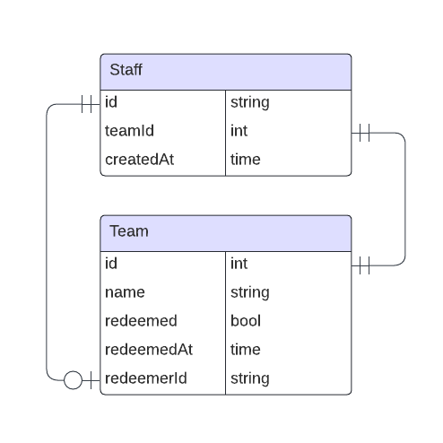
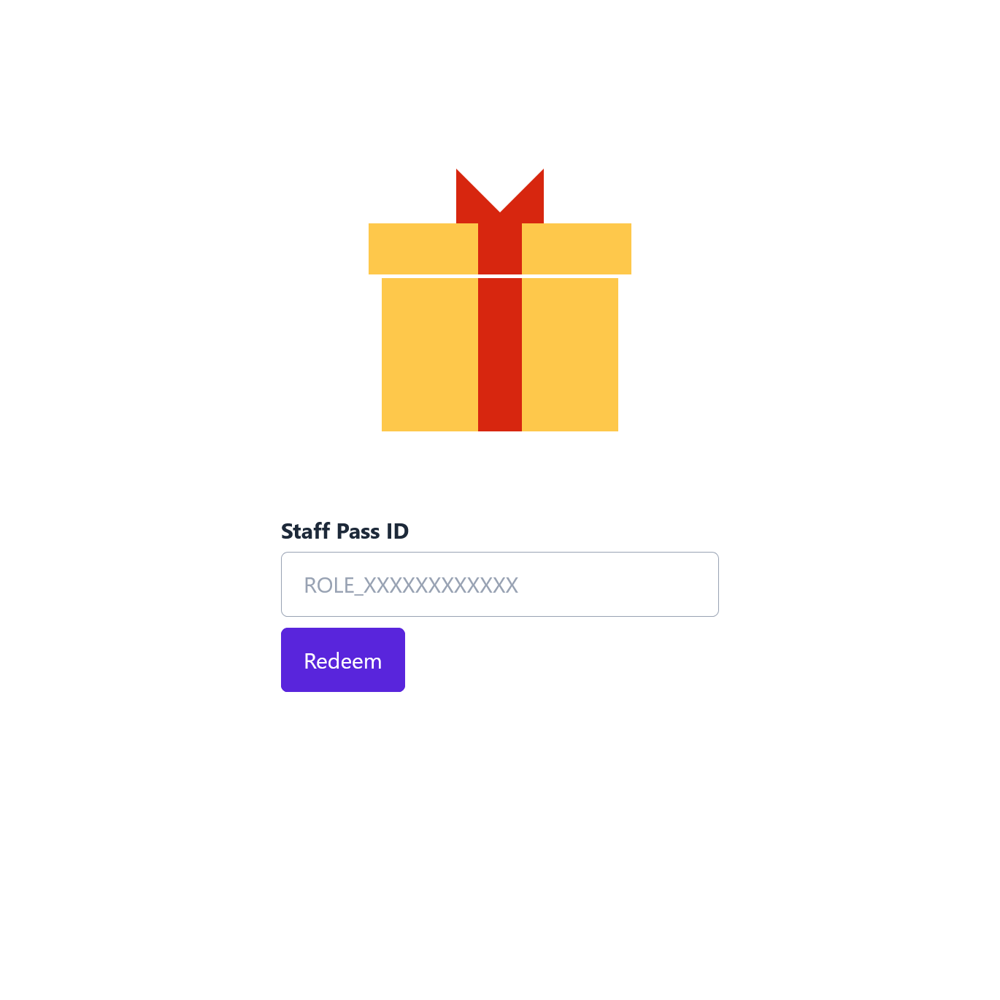
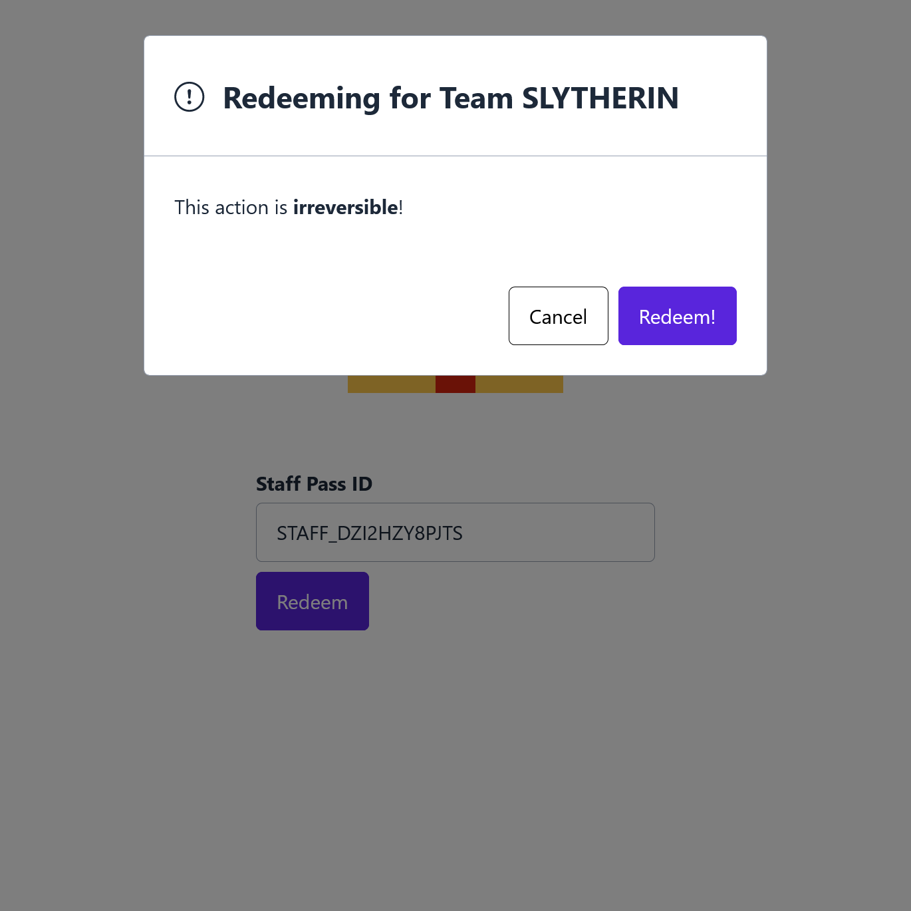
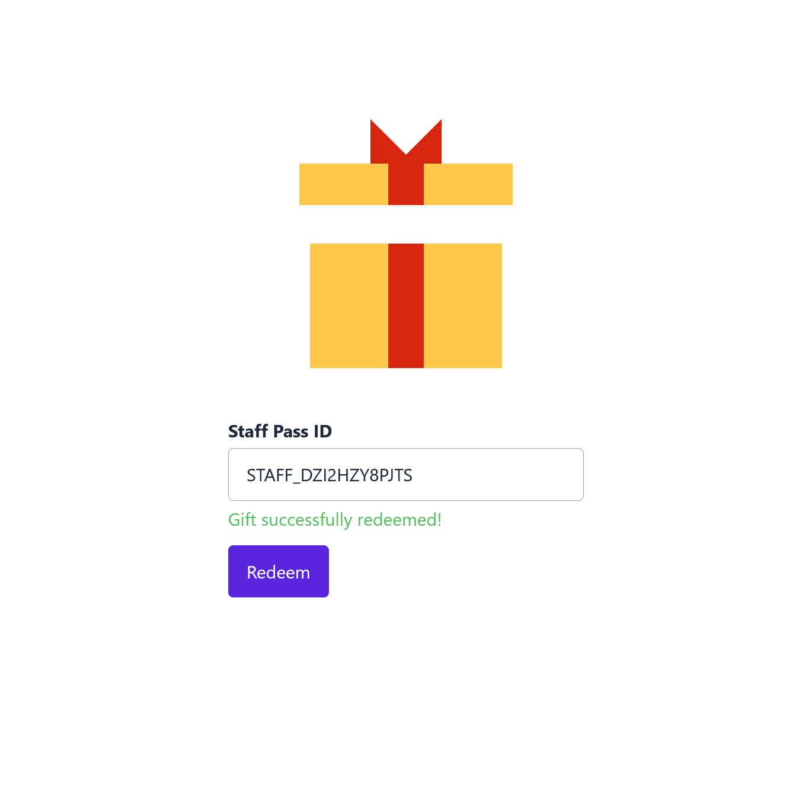
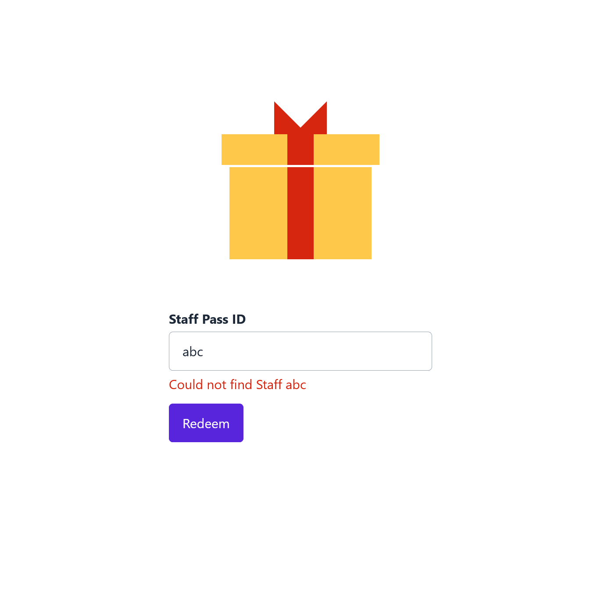

# GovTech Take-Home Assignment

_By Yip Ying Fung Leslie_

### Usage

```
docker build -t govtech-take-home-assignment .
docker-compose up --force-recreate -V
```

## Task

1. Perform look up of the representative's staff pass ID against the mapping file
2. Verify if the team can redeem their gift by comparing the team name against past
   redemption in the redemption data
3. Add new redemption to the redemption data if this team is still eligible for
   redemption, otherwise, do nothing and send the representative away

## Implementation

I chose to use Node.js and TypeScript with Express as the back-end. I implemented the database using PostgreSQL, with Sequelize as the ORM.

-   `src/server`: Contains source code for the Express server. On build, the files will be output in `dist/server`.
-   `src/client`: Contains the source code for the front end. On build, the files will be output in `public`.
-   `tests`: Contains Mocha test suites. Can be run with `npm run test`.

### Assumptions

-   `staff_pass_id`s are unique
-   `team_name`s are unique
-   Each staff can only belong to one team
-   Authentication is not required. Each staff member only knows their own ID, and cannot use someone else's ID to claim the gift.

### Server

The server is implemented with Express. There are 2 main routes:

#### `/staff`

-   `GET`: Gets a staff's team (Function 1)

#### `/redeem`

-   `GET`: Gets a team's eligibility for redemption (Function 2)
-   `PUT`: Redeems the gift by updating the team's records (Function 3)

### Database

The database is implemented with PostgreSQL and Sequelize as the ORM. There are 2 tables within the database:



#### `staff`:

Each staff pass ID is tagged to one staff, and each staff belongs to 1 team. This allows the app to look up a staff's team. `createdAt` corresponds to the timestamp of the mapping's creation.

#### `teams`:

Each record in `teams` records whether a particular team's gift has been redeemed. On redemption, the `redeemAt` field will be updated to reflect the change.

While not necessary for the task, I also chose to implement `redeemerId`, which can be used to record who was responsible for the redemption. This could be useful for the sake of accountability and further features.

### User Interface

The front end utilises components from the Singapore Government Design System. 

|Input Form                       |Confirmation Modal                          |
|---------------------------------|--------------------------------------------|
|||

#### Input Form
Users can input their staff pass ID, and perform a look up which checks their team's eligiblity for redemption.

#### Confirmation Modal
Users must confirm their intentions to redeem for their team. This is to safeguard against misinputs, and can be extended to include additional verification steps.

|Redemption Message            |Error Message           |
|------------------------------|------------------------|
|||

#### Redemption Message
Provide feedback to user that their gift has been redeemed. This should be extended to provide information on what was actually redeemed.

#### Error Message
Provide feedback to user if the gift cannot be redeemed (e.g. gift has already been redeemed, invalid staff pass ID).